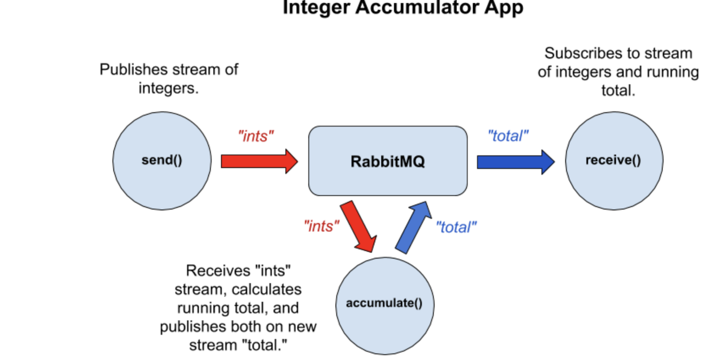

### Пример использования связки Spring Cloud Stream + Rabbit MQ + Okta

- Получите аккаунт **developer-okta**

##### Установите:
- docker
- разверните в docker **rabbit mq**
- httpie
- java 17
- maven

###### Микросервисы

- **producer-service**: будет генерировать целые числа.
  Здесь будет размещен защищенный ресурс, доступ к которому будет 
  возможен через авторизацию и атентификацию через Okta-server, 
  по протоколу OpenID Connect, который расширяет возможности протокола
  OAuth2.

- **processor-service**: данный сервис будет подписан на очередь, 
  куда публикуются сообщения из **producer-service**. После того, как он 
  обработает эти сообщения, они отправляются в другую очередь, на 
  которую подписан **consumer-service**.

- **consumer-service**: подписан на очередь, куда **processor-service**
  публикует обработанные сообщения.

### Архитектура приложения

