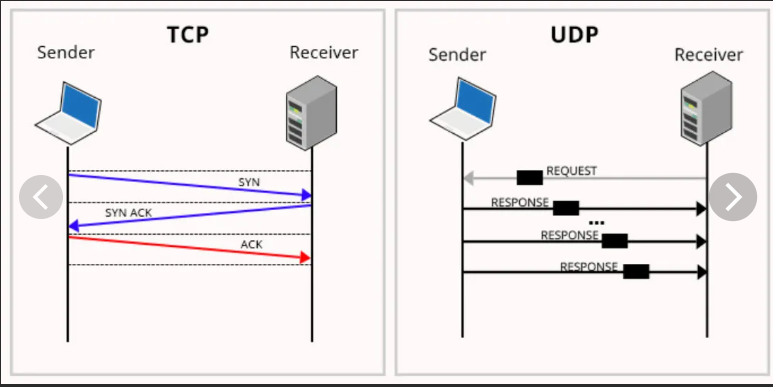

### Простой UDP-server и client


- Разница между UDP и TCP



1. Отсутствие накладных расходов у **UDP** может сделать его значительно быстрее, чем **TCP**.
2. Помимо скорости, мы также должны помнить, что некоторые виды связи 
 не требуют надежности **TCP**, но вместо этого ценят низкую задержку (**low latency**).
  Передача **_видео-потока_** является хорошим примером приложения, которое может извлечь выгоду 
 из работы через **UDP** вместо _TCP_.


- Для создаваемого приложения будем использовать популярный протокол **echo**.
- Сначала мы создадим _**echo-server**_, который отправляет 
 обратно, любое отправленное ему сообщение. 
- Затем создадим **_echo-client_**, который просто отправляет любое произвольное сообщение на _**echo-server**_. 
- Протестируем приложение, чтобы убедиться, что все работает нормально.


- Указываем порт на котором будет запущен UDP-server: 

```yaml
app:
  port: 4445
```

- Указываем размер буфера, который будет накапливать сообщения отправляемые на UDP-server.

```yaml
app:
  size:
    buffer: 256
```

- Указываем ключевое слово, для остановки UDP-server. Если клиент отправит указанное
значение, тогда сервер остановится.

```yaml
app:
  signal:
    server: end
```